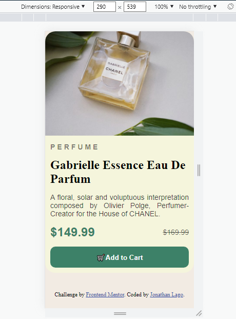

# Frontend Mentor - Product preview card component solution

This is a solution to the [Product preview card component challenge on Frontend Mentor](https://www.frontendmentor.io/challenges/product-preview-card-component-GO7UmttRfa). Frontend Mentor challenges help you improve your coding skills by building realistic projects. 

## Table of contents

- [Overview](#overview)
  - [The challenge](#the-challenge)
  - [Screenshot](#screenshot)
  - [Links](#links)
- [My process](#my-process)
  - [Built with](#built-with)
  - [Useful resources](#useful-resources)
- [Author](#author)

## Overview

### The challenge

Users should be able to:

- View the optimal layout depending on their device's screen size
- See hover and focus states for interactive elements

### Screenshot

### Links

- Solution URL: [Minha solução](https://github.com/JhonnyJohnJones/Preview-de-Produto)
- Live Server URL: [Site no Vercel](https://preview-de-produto.vercel.app/)

## My process

### Built with

- Semantic HTML5 markup
- CSS custom properties
- Flexbox
- CSS Grid
- Mobile-first workflow

### Useful resources

- [W3School Grid](https://www.w3schools.com/css/css_grid.asp) - Me ajudou bastante com css grid, pois nunca tinha usado antes.
- [W3School @media](https://www.w3schools.com/cssref/css3_pr_mediaquery.asp) - É um ótimo guia de como usar @media no css, que funciona para mais responsividade.

## Author

- Frontend Mentor - [@JhonnyJohnJones](https://www.frontendmentor.io/profile/JhonnyJohnJones)
- Twitter - Perfi minha conta ;-;
